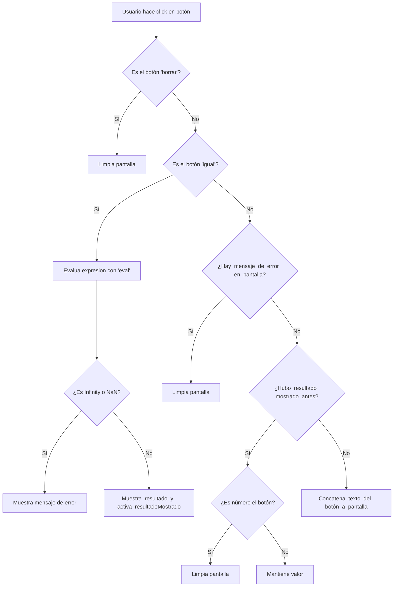

## Índice

- [Mini Calculadora con JavaScript](#mini-calculadora-con-javascript)
- [Complejidad](#complejidad)
- [Creando la mini calculadora](#creando-la-mini-calculadora)
- [Comandos y conceptos aprendidos](#comandos-y-conceptos-aprendidos)
- [Diagrama UML](#diagrama-uml)
- [Herramientas utilizadas](#herramientas-utilizadas)
- [Conclusiones](#conclusiones)

# Mini Calculadora con JavaScript!

He comenzado las vacaciones de verano desarrollando proyectos en diferentes lenguajes para ir mejorando de cara al año que viene. Para este pequeño proyecto, he realizado una mini calculadora con **HTML**, **CSS** y **JavaScript**. 

# Complejidad

En el primer curso no vimos mucho de JavaScript por diversas razones, así que quería reforzar por mi cuenta este lenguaje tan usado.
Si bien con lo poco que hemos visto de  **JavaScript** y el conocimiento bastante bueno que tengo de **Java**, no ha sido muy complicado ir aprendiendo por mi cuenta los diferentes comandos y usos de este lenguaje.
Por tanto diría que al basarme en un proyecto existente, la complejidad ha sido bastante baja, tanto para programarla como para "mejorarla".

## Creando la mini calculadora

Para la creación de esta pequeña calculadora, al principio, iba siguiendo un tutorial. De ese modo, buscaba aprender a usar los diferentes comandos y lógica de JavaScript, pero en lugar de seguirlo paso a paso, he usado los conocimientos que ya tenía tanto de **Java** como de **HTML** y **CSS** para realizar modificaciones tanto en el código como en la parte visual.

## Comandos y conceptos aprendidos

Algunos de estos ya los conocía de **Java**, pero este proyecto me ha servido para ver cómo se realiza en JavaScript.

| Concepto               | Código de ejemplo                                | Explicación breve                                                                 |
|------------------------|--------------------------------------------------|-----------------------------------------------------------------------------------|
| Constante              | `const pantalla = ...`                           | Declara una variable que **no cambia** su valor.                                 |
| Variable (mutable)     | `let resultadoMostrado = false`                 | Declara una variable cuyo valor **puede cambiar**.                               |
| getElementById         | `document.getElementById('pantalla')`           | Selecciona un elemento por su atributo **id** en el HTML.                        |
| querySelectorAll       | `document.querySelectorAll('button')`           | Selecciona **todos los elementos** que coincidan con el selector.                |
| Evento `click`         | `boton.addEventListener('click', () => {})`     | Escucha el **clic del usuario** en un botón y ejecuta una función.               |
| Función flecha         | `() => { ... }`                                  | Forma moderna de definir funciones. Flecha `=>` indica qué hacer.                |
| forEach                | `botones.forEach(boton => { ... })`             | Recorre todos los elementos (botones) uno por uno y ejecuta algo para cada uno.  |
| Condicional `if`       | `if (condición) { ... } else { ... }`           | Ejecuta diferentes bloques de código según si la condición se cumple o no.       |
| Estructura `try/catch` | `try { ... } catch (e) { ... }`                 | Intenta ejecutar código y **atrapa errores** si ocurren.                         |
| `eval()`               | `eval("2+2")`                                    | Interpreta una cadena como código JavaScript y la ejecuta. ⚠️ Puede ser peligroso.|
| `isNaN()`              | `isNaN(valor)`                                   | Devuelve `true` si el valor **no es un número válido**.                          |
| `includes()`           | `array.includes(valor)`                          | Devuelve `true` si el **array contiene ese valor**.                              |
| Modificar valor input  | `pantalla.value = 'nuevo texto'`                | Cambia el contenido que se muestra en un input del tipo texto.                   |
| Concatenar texto       | `pantalla.value += boton.textContent`           | Añade texto al final del contenido actual.                                       |

## Diagrama UML

## Herramientas utilizadas

- **Visual Studio Code**: como entorno de desarrollo (IDE)
- **Udemy**: para aprender JavaScript de forma estructurada
- **StackEdit.io**: para redactar y visualizar el archivo Markdown
- **Mermaid.live**: para crear diagramas UML en Markdown

# Conclusiones

Este proyecto me ha sido útil para poder aprender comandos y conceptos nuevos en JavaScript, así como para repasar y afianzar algunos que ya conocía. 
Aunque la lógica del proyecto no era especialmente compleja, me ha servido para practicar así como para ser capaz de ver que aún podría mejorarla y pasar a un siguiente nivel, aunque por el momento prefiero dejarla así y seguir aprendiendo otros conceptos que creo que me serán de utilidad en un futuro próximo.
Además, este pequeño proyecto me ha servido como salida para comenzar a **documentar mis avances en programación** y a motivarme a seguir aprendiendo mediante pequeños objetivos y metas.
